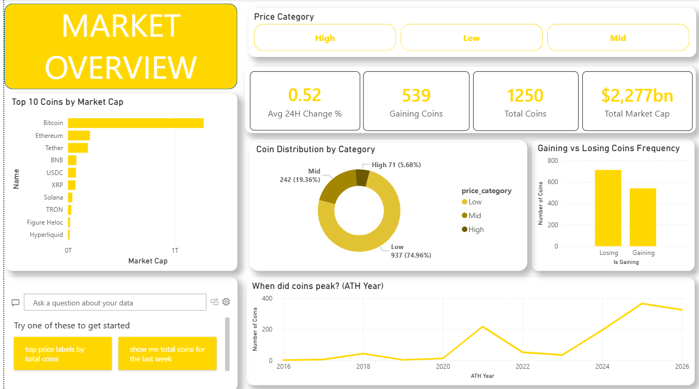
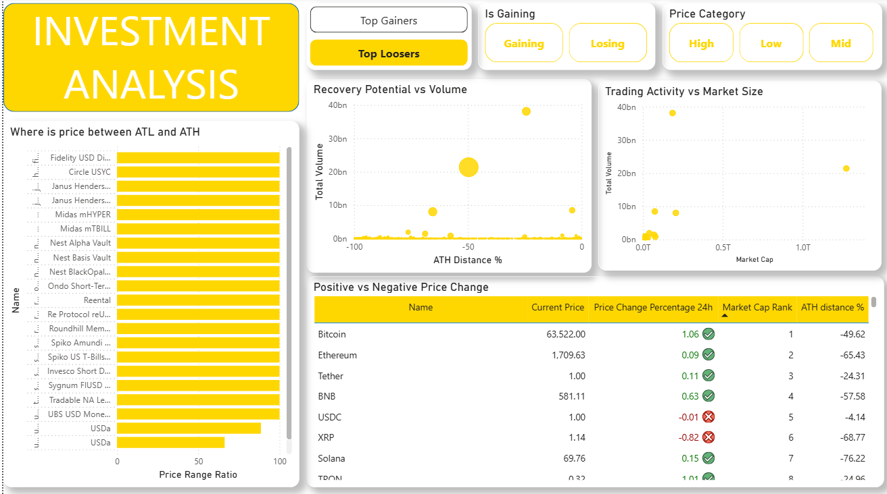
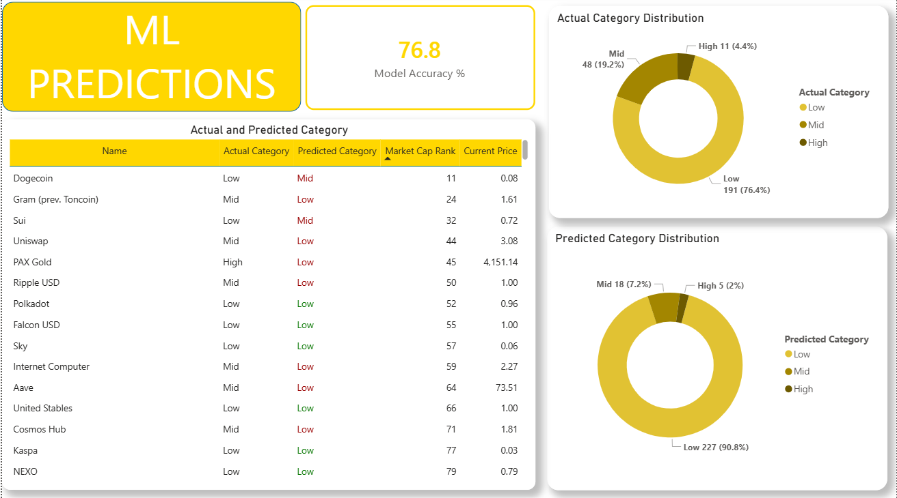
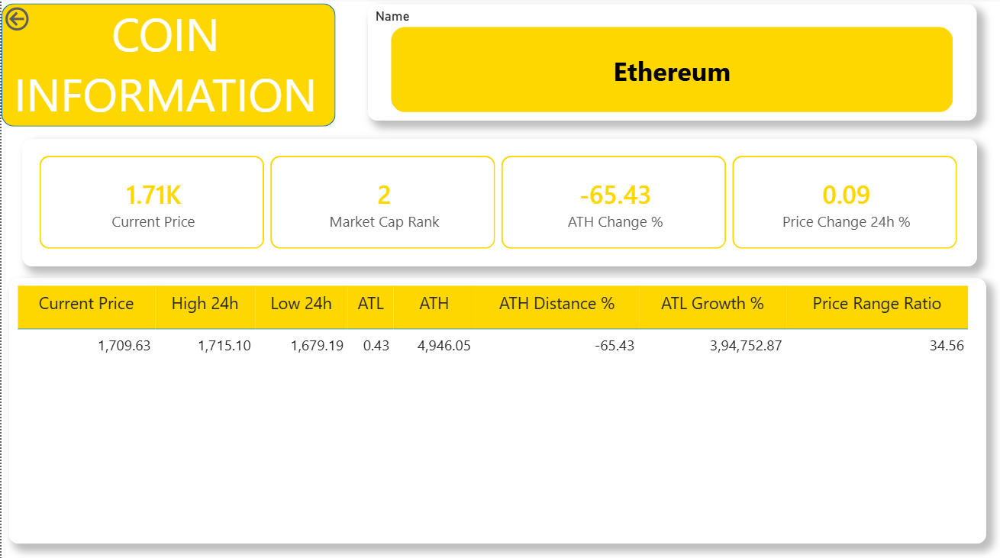

# 🪙 Crypto Market Analytics
## Data Science Capstone Project


## 📋 Project Overview
End-to-end data science project analyzing
cryptocurrency market data to identify
investment opportunities and predict
coin value categories.

**Business Problem:**
> Which cryptocurrencies offer the best
> investment opportunities based on
> market data and historical performance?

---

## 🗂️ Project Structure
crypto_project/
├── data/
│   ├── raw/          ← Scraped CSV files
│   └── clean/        ← Processed datasets
├── notebooks/
│   ├── 01_data_collection.ipynb
│   └── 02_cleaning_model.ipynb
├── models/
│   ├── clf_model.pkl
│   └── scaler.pkl
├── reports/
│   └── [EDA charts]
├── logs/
└── README.md

---

## 🔧 Tech Stack
| Tool | Purpose |
|------|---------|
| Python | Data collection & ML |
| CoinGecko API | Data source |
| Pandas/NumPy | Data processing |
| Scikit-learn | ML model |
| Matplotlib/Seaborn | Visualization |
| SQLite | SQL analysis |
| Power BI | Dashboard |

---

## 📊 Dataset
- **Source:** CoinGecko Public API
- **Records:** 1,250 coins
- **Features:** 26 columns
- **Collection:** June 2026

---

## 🔄 Pipeline

### Phase 1 — Data Collection
- CoinGecko API with pagination
- 5 pages × 250 coins = 1250 records
- Professional error handling
- Exponential backoff for rate limits
- State persistence for recovery

### Phase 2 — Data Cleaning
- Dropped high null columns (>35%)
- Fixed weekend effect nulls
- Feature engineering (3 new features)
- Handled infinity values

### Phase 3 — SQL Analysis
- 6 analytical queries
- Top gainers/losers
- ATH analysis
- Volume analysis

### Phase 4 — EDA
- 8 visualizations
- Price distribution analysis
- Market concentration study
- Correlation analysis

### Phase 5 — ML Model
- Random Forest Classifier
- Target: price_category (low/mid/high)
- Accuracy: 76.8%
- Handled class imbalance

### Phase 6 — Power BI Dashboard
- 4 interactive pages
- Bookmarks, Drill Through
- RLS, Sync Slicers
- AI Visual

---

## 📈 Key Findings
1. 2025-2026 is strongest bull market ever
2. Bitcoin dominates with $1.27T market cap
3. 99% of coins priced under $5000
4. Most coins move ±5% daily
5. Market cap strongly correlates with volume

---

## 🤖 ML Results
Model    : Random Forest Classifier
Accuracy : 76.8%
Classes  : Low / Mid / High value coins
Precision:
→ Low  coins: 81%
→ Mid  coins: 58%
→ High coins: 62%

---

## 🚀 How to Run

### 1. Clone Repository
```bash
git clone https://github.com/
[username]/crypto-analytics
cd crypto-analytics
```

### 2. Install Dependencies
```bash
pip install pandas numpy requests
scikit-learn matplotlib seaborn
jupyter
```

### 3. Run Collection Script
```bash
jupyter notebook
# Open 01_data_collection.ipynb
# Run all cells
```

### 4. Run Cleaning & ML
```bash
# Open 02_cleaning_model.ipynb
# Run all cells
```

### 5. Open Dashboard
Open dashboard.pbix in Power BI Desktop
Refresh data connections

---

## 📸 Dashboard Screenshots

[YOU NEED TO DO THIS PART]
Add screenshots here like:






---

<!-- ## 🎥 Video Demo
[Add your Google Drive link here]

--- -->

## 📧 Contact
Himanshu Chikhlonde
himanshuchikhlonde14@gmail.com
www.linkedin.com/in/himanshu-chikhlonde-aa0224247

---

## ⚠️ Disclaimer
This project is for educational purposes.
Not financial advice.